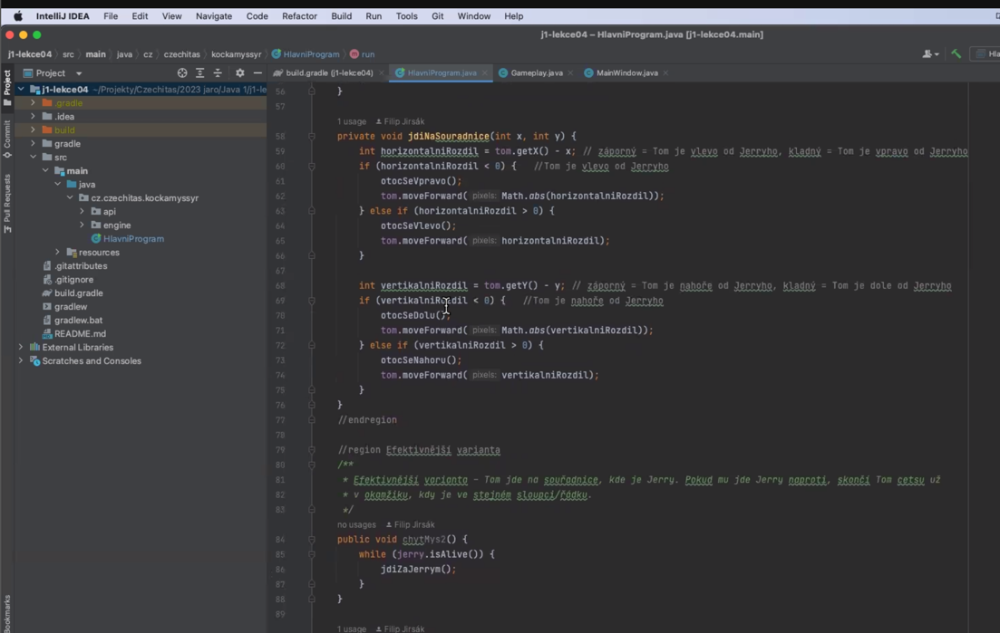

# Kočka a myš

## Pravidla
* Kočka i myš se mohou pohybovat jen vodorovně a svisle.
* Myš se snaží sníst jitrnici a sýr.
* Kočka se snaží chytit myš.
* Kočka ani myš nemohou projít skrze strom.
* Myš se ovládá pomocí šipek, kočka pomocí kláves A, S, D, W.

## Cíl
Pokud myš sní jitrnici i sýr, vyhrála myš. Pokud dřív kočka chytí myš, vyhrála kočka.

## Cvičení
Naprogramujte chování kočky tak, aby chytila myš.

U myši budete potřebovat znát její aktuální polohu – tu získáte pomocí metod `getX()` a `getY()`.

U kočky budete potřebovat znát její aktuální polohu (stejně jako u myši), dále metody `turnLeft()`, `turnRight()`, `moveForward()`.
Metoda `moveForward()` má dvě varianty – můžeš zadat, jak daleko má kočka jít, nebo (bez parametru) s eposune jen o kousek.
Zda se kočka může posunout dopředu zjistíte voláním metody `isPossibleToMoveForward()`.
Pro zjištění směru, kterým se kočka dívá, použijete metodu `getOrientation()`, například následujícím způsobem:

```java
if (cat.getOrientation() == PlayerOrientation.UP) {
    //kočka se dívá nahoru
}
```

Nepodvádějte a ve vašem kódu nemanipulujte s myší, tu nechte ovládat jenom uživatelem 😀

### Nápověda

Vytvoř metodu, která zjistí souřadnice myši a pomocí metod turnLeft(), turnRight() a moveForward(int) naviguje kočku na tyto souřadnice.
Uvědom si, že dráha kočky bude stejná, ať kočka půjde nejprve celou dobu jedním směrem (třeba horizontálně) a pak druhým směrem (třeba vertikálně), nebo pokud půjde „po schodech“.
Otočení kočce ale chvilinku trvá – proto je lepší, když půjde rovně tak dlouho, jak potřebuje, a teprve pak se otočí.

Předchozí kroky v cyklu opakuj tak dlouho, dokud je myš živá (zjistíš voláním metody `isAlive()`).

Předchozí kód se dá vylepšit tak, že kočka nepoběží v jednom cyklu tam, kde viděla myš na začátku, ale tam, kde je myš zrovna teď.

💡 Obvykle se nevyplatí dělat algoritmus moc složitý.
Klidně kód udělej tak, že kočka vyrazí nejprve horizontálně směrem, kde je myš, a když se dostane do stejného sloupce, bude pokračovat vertikálně. 

### Vylepšení

V dosavadním kódu se nebere v úvahu přítomnost stromů.
Pokud kočka narazí na strom, zasekne se a pokračovat bude teprve tehdy, až mezi ní a myší nebude strom.
Myš se tedy může za strmy schovávat.
Můžeš tedy kód upravit tak, že když kočka narazí na strom, bude se mu snažit vyhnout.
Opět není potřeba vymýšlet žádný složitý algoritmus – úplně bude stačit, když se kočka otočí a kousek popojde.